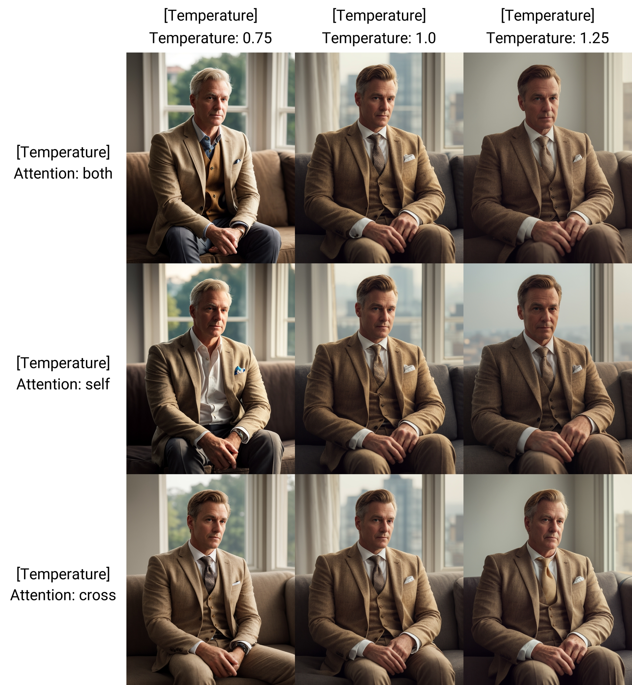

# SD Forge Temperature Settings
This is an Extension for the [Forge Webui](https://github.com/lllyasviel/stable-diffusion-webui-forge), which implements "temperature settings."

> This does **not** work with [Automatic1111 Webui](https://github.com/AUTOMATIC1111/stable-diffusion-webui)

- **TL;DR:** Kinda like `FreeU`, just play around the parameters to get different results. Wouldn't say it will be necessarily better...

 
<code>a cinematic photo of a gentleman in suit, sitting on sofa, depth of field, bokeh, golden hour</code> 
<b>Checkpoint:</b> realisticVision v5.1

- Credits to the original author, **[Extraltodeus](https://github.com/Extraltodeus)**, whose [ComfyUI Node](https://github.com/Extraltodeus/Stable-Diffusion-temperature-settings) I used to port into Forge
